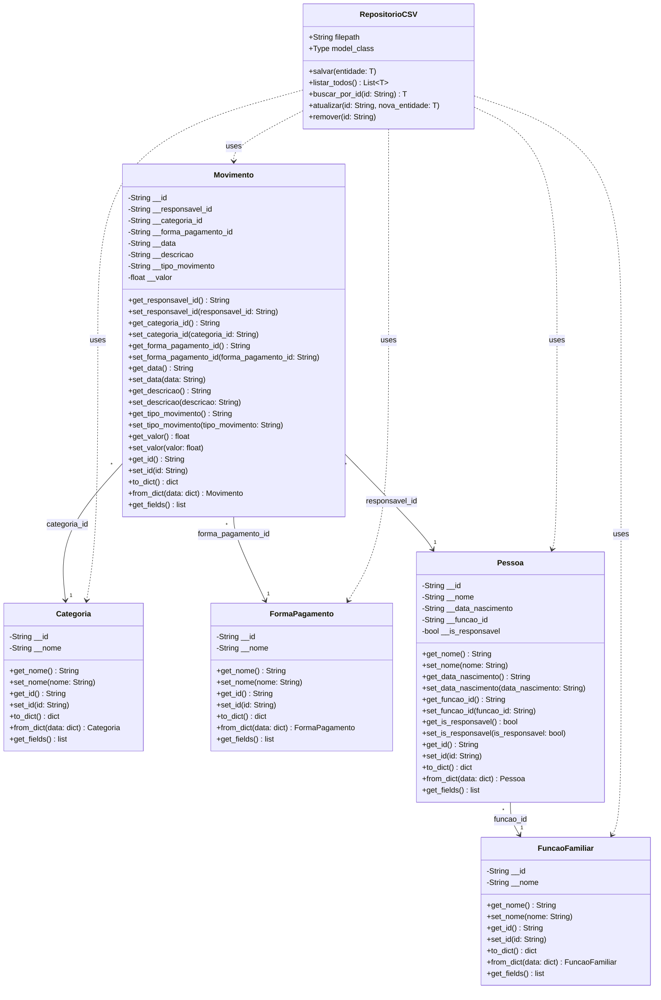

```mermaid
classDiagram
  class Categoria {
    -String __id
    -String __nome
    +get_nome() String
    +set_nome(nome: String)
    +get_id() String
    +set_id(id: String)
    +to_dict() dict
    +from_dict(data: dict) Categoria
    +get_fields() list
  }

  class FormaPagamento {
    -String __id
    -String __nome
    +get_nome() String
    +set_nome(nome: String)
    +get_id() String
    +set_id(id: String)
    +to_dict() dict
    +from_dict(data: dict) FormaPagamento
    +get_fields() list
  }

  class FuncaoFamiliar {
    -String __id
    -String __nome
    +get_nome() String
    +set_nome(nome: String)
    +get_id() String
    +set_id(id: String)
    +to_dict() dict
    +from_dict(data: dict) FuncaoFamiliar
    +get_fields() list
  }

  class Pessoa {
    -String __id
    -String __nome
    -String __data_nascimento
    -String __funcao_id
    -bool __is_responsavel
    +get_nome() String
    +set_nome(nome: String)
    +get_data_nascimento() String
    +set_data_nascimento(data_nascimento: String)
    +get_funcao_id() String
    +set_funcao_id(funcao_id: String)
    +get_is_responsavel() bool
    +set_is_responsavel(is_responsavel: bool)
    +get_id() String
    +set_id(id: String)
    +to_dict() dict
    +from_dict(data: dict) Pessoa
    +get_fields() list
  }

  class Movimento {
    -String __id
    -String __responsavel_id
    -String __categoria_id
    -String __forma_pagamento_id
    -String __data
    -String __descricao
    -String __tipo_movimento
    -float __valor
    +get_responsavel_id() String
    +set_responsavel_id(responsavel_id: String)
    +get_categoria_id() String
    +set_categoria_id(categoria_id: String)
    +get_forma_pagamento_id() String
    +set_forma_pagamento_id(forma_pagamento_id: String)
    +get_data() String
    +set_data(data: String)
    +get_descricao() String
    +set_descricao(descricao: String)
    +get_tipo_movimento() String
    +set_tipo_movimento(tipo_movimento: String)
    +get_valor() float
    +set_valor(valor: float)
    +get_id() String
    +set_id(id: String)
    +to_dict() dict
    +from_dict(data: dict) Movimento
    +get_fields() list
  }

  class RepositorioCSV {
    +String filepath
    +Type model_class
    +salvar(entidade: T)
    +listar_todos() List~T~
    +buscar_por_id(id: String) T
    +atualizar(id: String, nova_entidade: T)
    +remover(id: String)
  }

  Pessoa "*" --> "1" FuncaoFamiliar : funcao_id
  Movimento "*" --> "1" Pessoa : responsavel_id
  Movimento "*" --> "1" Categoria : categoria_id
  Movimento "*" --> "1" FormaPagamento : forma_pagamento_id

  RepositorioCSV ..> Movimento : uses
  RepositorioCSV ..> Pessoa : uses
  RepositorioCSV ..> Categoria : uses
  RepositorioCSV ..> FormaPagamento : uses
  RepositorioCSV ..> FuncaoFamiliar : uses
```
